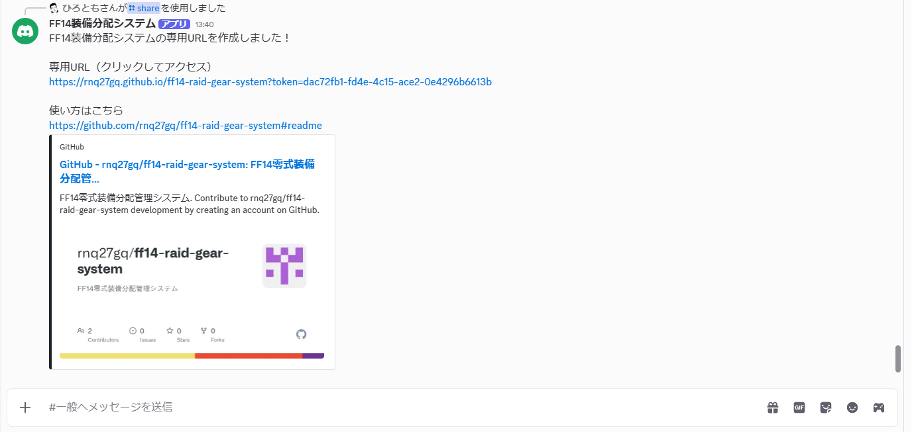
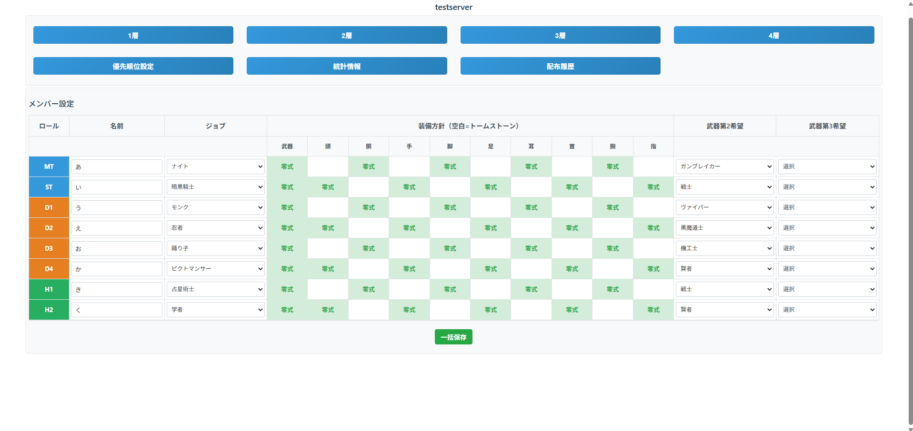
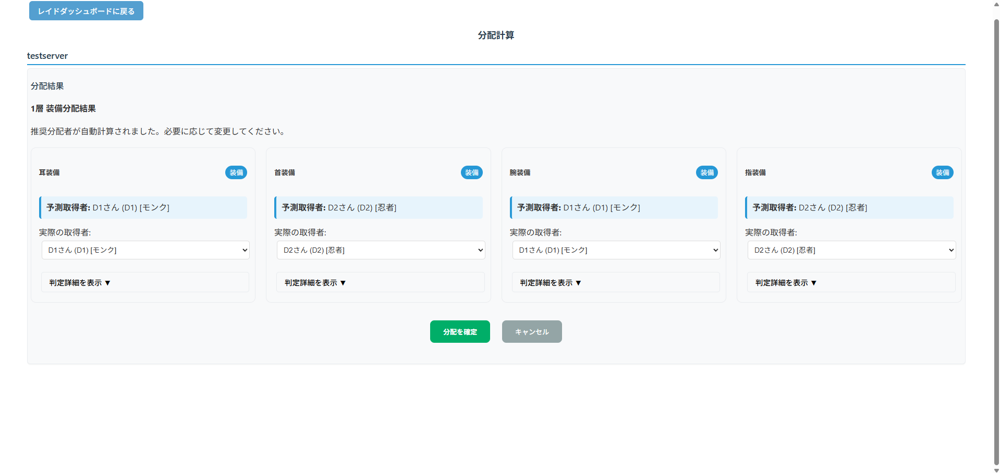
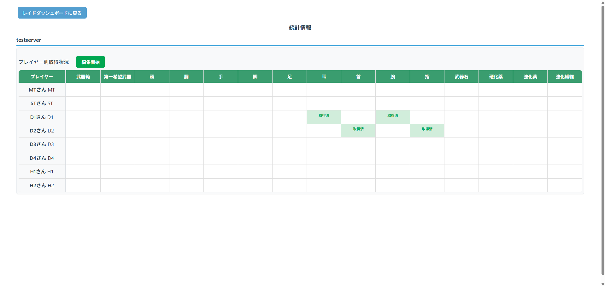
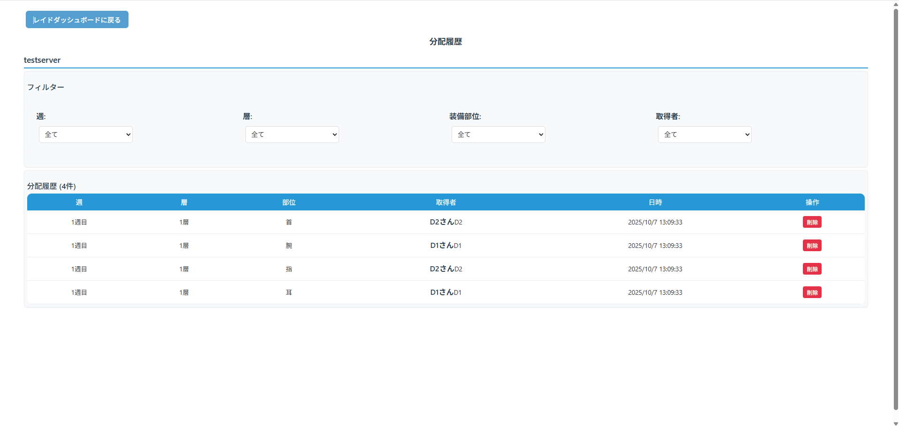

# FF14 零式装備分配システム 

**FF14の零式レイドで装備を公平に分配するためのWebアプリケーション**

---

## 目次
- [Discord Bot導入](#discord-bot導入)
- [クイックスタート](#クイックスタート)
- [詳しい使い方](#詳しい使い方)
- [分配システムの仕組み](#分配システムの仕組み)
- [よくある質問](#よくある質問)
- [技術スタック](#技術スタック)
---

## Discord Bot導入

### Botをサーバーに追加

以下のリンクをクリックして、あなたのDiscordサーバーにBotを招待してください。

[Botを招待する](https://discord.com/oauth2/authorize?client_id=1421136327843250286&permissions=2147485696&integration_type=0&scope=bot+applications.commands)

必要な権限:
- メッセージを送信
- スラッシュコマンドを使用

---

## クイックスタート

### 1. Discordで専用URLを作成

DiscordサーバーでDiscord Botの `/share` コマンドを実行します。

<i>Discord /share コマンド画面</i>

専用URLが生成されます。このURLをクリックしてアクセスしてください。

### 2. 専用URLにアクセス

共有されたURLをクリックすると、ダッシュボードが表示されます。

<i>トップページ（ダッシュボード）</i>

---

### 3. メンバー情報を設定

メンバー設定ブロックで8人分の情報を入力します。

#### 入力項目
- **名前** - プレイヤー名
- **ジョブ** - 各メンバーのジョブ
- **装備方針** - 最適装備が零式の部位をクリック（空白=トームストーン）
- **武器希望** - 第2・第3希望の武器を設定

#### 保存
すべて入力したら「一括保存」をクリック。
途中経過も保存できます（1名以上の名前とジョブ入力必須）。

---

## 詳しい使い方

### 装備分配の実行

#### 手順

1. **層を選択**
   レイドをクリアしたらダッシュボード上で対応する層（1層/2層/3層/4層）をクリック

2. **分配を確定**
   ドロップしたアイテムとシステムが提案した分配先を確認して「分配を確定」ボタンをクリック

   
   
<i>分配計算画面</i>

3. **統計情報を確認**
   システムが分配結果を自動記録します

   
   
<i>統計情報画面</i>

---

### 断章交換システム

断章で装備を交換したプレイヤーの特別処理（武器箱～指装備に対応）

#### 使い方
1. 統計情報画面で「編集開始」をクリック
2. プルダウンで「断章交換」を選択
3. 断章で零式装備を交換した状態として記録されます

#### 動作ルール
- **一時除外** - 零式設定でドロップ箱未取得のプレイヤーがいる間は分配対象外
- **復帰** - 全員に行き渡ったら分配対象に復帰
- **完全除外** - ドロップ箱を取得すると「断章交換・箱取得済」に自動更新され完全除外

#### ステータス一覧
| ステータス | 説明 |
|-----------|------|
| 未取得 | 未取得プレイヤー |
| 取得済 | ドロップ箱取得プレイヤー |
| 断章交換 | 断章で交換済み、ドロップ箱未取得 |
| 断章交換・取得済 | 断章で交換済み、ドロップ箱取得済み |

---

### 配布履歴の確認

「配布履歴」ボタンをクリックすると、過去の分配記録を確認できます。

<i>配布履歴画面</i>

#### フィルター機能
- **週** - 週ごとにフィルター
- **層** - 1層〜4層でフィルター
- **装備部位** - 特定部位でフィルター
- **取得者** - 特定プレイヤーでフィルター

#### 削除機能
各データの右端にある「削除」ボタンで誤った記録を削除できます。

---

## 分配システムの仕組み

### 優先度計算

システムは以下の要素で分配優先度を自動計算します：

1. **装備方針**
   - 零式設定: 優先度高
   - トームストーン設定（空白）: 優先度低

2. **ポジション優先度**
   - デフォルト: D1 → D2 → D3 → D4 → MT → ST → H1 → H2
   - 優先順設定画面からドラッグ&ドロップで変更可能

3. **取得履歴**
   - 1,2の合計値が同じ優先度内では装備取得数が少ないプレイヤーを優先

1-3で算出された優先度合計値が高いプレイヤーに分配していきます。

4. **直ドロップ武器分配**
   - 攻略中のジョブ > 第2希望 > 第3希望の順に優先

**8週クリア時の理想状態:**
- 全員が「緑色（取得済）」または「青色（断章交換・箱取得済）」

---

## よくある質問

### Q: メンバーを途中で変更できる？

A: 可能です。メンバー設定ブロックから編集して「一括保存」をクリックしてください。

### Q: 間違って分配を確定してしまった場合は？

A: 配布履歴画面の「削除」ボタンで該当記録を削除できます。または統計情報の「編集開始」から手動修正も可能です。

### Q: 複数のレイドティアを管理できる？

A: 1つのリンクにつき1つのレイドが対応しています。  
新しいパッチの零式が始まる場合は、/shareコマンドで新しいリンクを作成してください。

---

## 技術スタック

### フロントエンド
- **HTML5 / CSS3** - レスポンシブデザイン
- **Vanilla JavaScript** - 依存関係なし、軽量で高速

### バックエンド / インフラ
- **Supabase** - PostgreSQLデータベース、リアルタイム同期
- **GitHub Pages** - 静的サイトホスティング（無料）
- **Fly.io** - Discord Botホスティング（無料枠で運用）

### Discord Bot
- **Node.js 18** - サーバーサイドJavaScript
- **discord.js v14** - Discord API ラッパー
- **Docker** - コンテナ化

### 開発ツール
- **Git / GitHub** - バージョン管理
- **PM2** - プロセス管理（ローカル開発用）

### 完全無料で運用可能
すべてのサービスの無料枠内で動作するよう設計されています。

---

## 開発者

**ひろとも** | 2025年

ファイナルファンタジーXIVコミュニティのために設計

